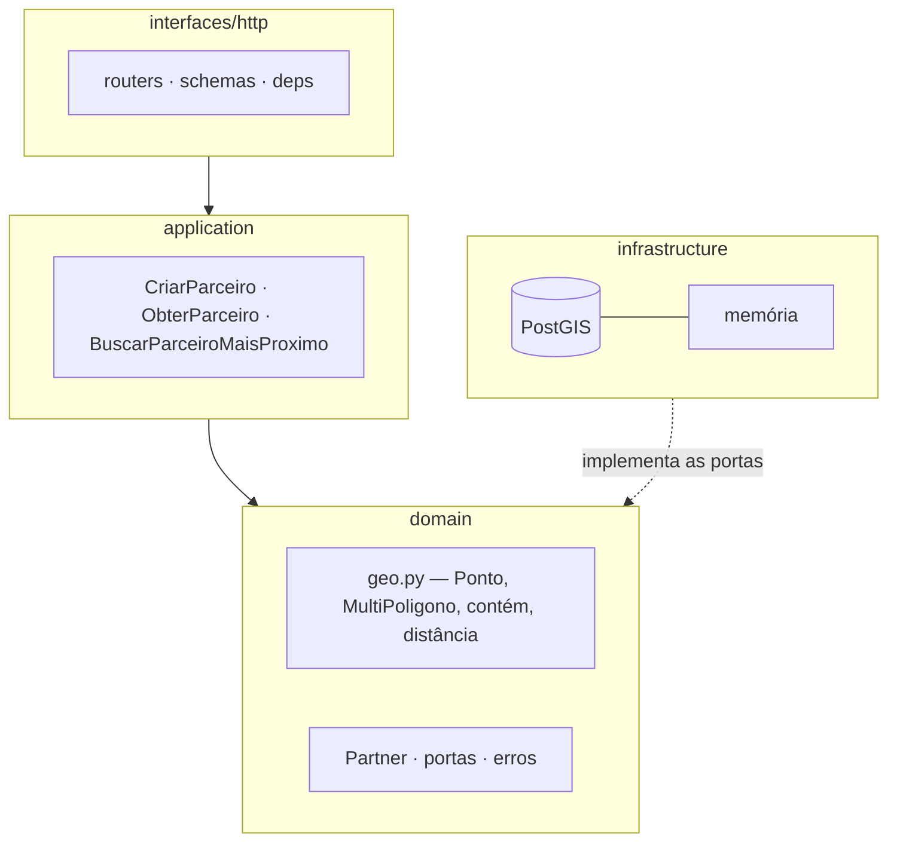

# Partner Geo API — busca geoespacial de parceiros


API REST que responde a uma pergunta com geometria de verdade: **qual parceiro
está mais próximo de mim entre aqueles cuja área de cobertura inclui a minha
localização?**

> Exercício baseado no [desafio de backend público da AB InBev / Zé
> Delivery](https://github.com/ab-inbev-ze-company/ze-code-challenges/blob/master/backend_pt.md).
> Este repositório é um projeto de portfólio, não uma submissão a processo
> seletivo, e não tem vínculo com as empresas citadas.

## O problema, e por que ele não é trivial

O desafio pede três operações, mas o peso está na terceira: *"dada uma
longitude e latitude, procure o parceiro que esteja **mais próximo** e **cuja
área de cobertura inclua** a localização"*. São duas condições diferentes, e
confundi-las é o erro clássico:

| | Campo | Operação | Papel |
|---|---|---|---|
| Cobertura | `coverageArea` (MultiPolygon) | o polígono **contém** o ponto | **filtro** — quem não cobre está fora, por mais perto que esteja |
| Proximidade | `address` (Point) | **distância** até o ponto | **ordenação** — desempata entre os que cobrem |

Um parceiro a 50 metros que não atende aquele endereço é resposta errada. Há
um teste só para isso: `test_busca_ignora_quem_nao_cobre`.

O segundo peso é performance — o desafio diz explicitamente *"quanto mais
parceiros na base de dados e mais rápido você conseguir buscar, melhor"*. Isso
elimina filtrar em memória e manda a decisão para o índice geoespacial.

## A consulta que resolve

```sql
SELECT ...
FROM partners
WHERE ST_Covers(coverage_area, ST_GeogFromText(:ponto))  -- índice GIST
ORDER BY ST_Distance(address, ST_GeogFromText(:ponto))   -- metros, WGS84
LIMIT 1
```

Três decisões dentro dessas três linhas:

- **`ST_Covers` e não `ST_Contains`**: um ponto exatamente na fronteira da área
  deve contar como coberto. Há teste para a fronteira.
- **`geography` e não `geometry`**: `ST_Distance` já devolve **metros** sobre o
  esferoide WGS84. Com `geometry`, a distância sairia em graus — e grau não é
  unidade de distância fora do equador, o que produz "mais próximo" errado.
- **Índice GIST nas duas colunas**: sem ele, `ST_Covers` vira varredura
  completa. Há um teste que lê o `EXPLAIN` e falha se o índice sumir.

## Arquitetura



A regra *"esta área cobre este ponto"* é de **negócio**, então vive no domínio
em Python puro (`app/domain/geo.py`, ray casting com suporte a buracos). O
PostGIS a executa em escala. Os dois têm de concordar — e
`tests/db/test_paridade_postgis.py` sorteia 50 pontos e exige a mesma resposta
dos dois. É a forma de provar que a otimização no banco não mudou a regra.

Detalhes e trade-offs em [`docs/arquitetura/`](docs/arquitetura/).

## Endpoints

| Método | Rota | Operação do desafio |
|--------|------|---------------------|
| `POST` | `/partners` | 1.1 — Criar parceiro |
| `GET` | `/partners/{id}` | 1.2 — Carregar parceiro |
| `GET` | `/partners/search?lon=&lat=` | 1.3 — Mais próximo que cobre |
| `GET` | `/health` | Health check |

Swagger em `/docs`. O contrato externo usa os nomes do desafio
(`tradingName`, `ownerName`, `coverageArea`), em camelCase.

```bash
curl -X POST localhost:8000/partners -H 'Content-Type: application/json' -d '{
  "tradingName": "Adega da Cerveja - Pinheiros",
  "ownerName": "Zé da Silva",
  "document": "1432132123891/0001",
  "coverageArea": {"type": "MultiPolygon", "coordinates": [[[[0,0],[1,0],[1,1],[0,1],[0,0]]]]},
  "address": {"type": "Point", "coordinates": [0.5, 0.5]}
}'

curl "localhost:8000/partners/search?lon=0.5&lat=0.5"
```

## Como rodar

```bash
cp .env.example .env
make install
make up && make migrate   # PostGIS em container + schema
make run                  # http://localhost:8000/docs
```

Sem Docker à mão, dá para subir a API inteira sem banco nenhum:

```bash
make run-memory           # adaptador em memória, mesma API
```

Ou tudo em container: `make docker-up` (as migrations rodam no start).

## Testes

```bash
make test      # rápido, sem serviço externo
make cov       # com cobertura (piso de 90%)
make test-db   # contra um PostGIS de verdade
```

| Nível | O que prova | Dependências |
|-------|-------------|--------------|
| `tests/unit/` | Geometria, entidades e casos de uso | nenhuma |
| `tests/integration/` | Contrato HTTP das três operações | nenhuma (adaptador em memória) |
| `tests/db/` | `ST_Covers` na fronteira, distância em metros, uso do índice, paridade com a regra de domínio | PostGIS |

Os testes de `tests/db/` se pulam sozinhos sem `TEST_POSTGRES_URL` e rodam num
job dedicado do CI, com o PostGIS como *service*. Por isso o piso de cobertura
do job rápido é 90%: o adaptador PostGIS é coberto no outro job.

## Estado atual

Esqueleto funcional: as três operações rodam fim a fim, com 43 testes rápidos
e 6 contra o PostGIS. O que ainda não existe está registrado em
[`docs/arquitetura/05-lacunas-e-roadmap.md`](docs/arquitetura/05-lacunas-e-roadmap.md)
— entre outros: carga em massa, paginação, cache e autenticação.
