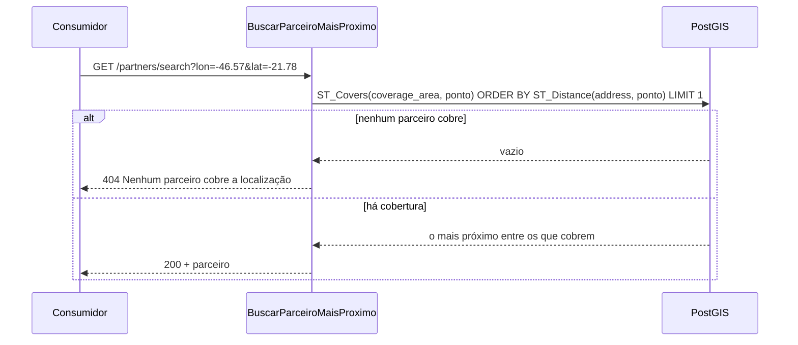
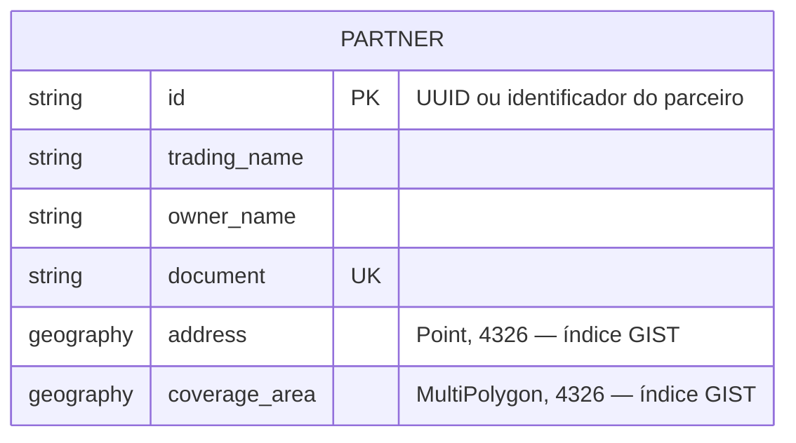

# 02 — Negócio e Dados (Fases B e C)

## Processo central: encontrar quem atende um endereço

A ordem importa e é a regra de negócio: **primeiro filtra por cobertura,
depois ordena por distância**. O inverso — pegar o mais próximo e checar se
cobre — devolve resposta errada sempre que o vizinho mais próximo não atende
aquele endereço.

## Regras de negócio

| ID | Regra | Onde é garantida |
|----|-------|------------------|
| RN-01 | `document` é único | `CriarParceiro` + `uq_partners_document` |
| RN-02 | `id` é único, e não precisa ser numérico | `CriarParceiro` + chave primária; UUID gerado no domínio |
| RN-03 | `coverageArea` é um MultiPolygon válido: anéis fechados, ≥ 4 posições | `MultiPoligono.de_geojson` |
| RN-04 | `address` é um Point com longitude em [-180, 180] e latitude em [-90, 90] | `Ponto.__post_init__` |
| RN-05 | Buraco no polígono **não** é área coberta | `MultiPoligono.contem` |
| RN-06 | Ponto na fronteira **é** área coberta | `ST_Covers` + teste em `tests/db/` |
| RN-07 | Sem parceiro que cubra o ponto, a resposta é "não encontrado" | `BuscarParceiroMaisProximo` |

## Modelo de dados

| Coluna | Tipo | Índice | Por quê |
|--------|------|--------|---------|
| `id` | `varchar(200)` | PK | O desafio permite id não numérico |
| `document` | `varchar(200)` | único | RN-01 |
| `address` | `geography(Point, 4326)` | GIST | Ordenação por distância em metros |
| `coverage_area` | `geography(MultiPolygon, 4326)` | GIST | Filtro `ST_Covers` sem varredura |

### `geography` vs `geometry`

Decisão registrada em [ADR-0001](adr/0001-postgis-geography.md). Em resumo:
com `geometry`, `ST_Distance` devolve **graus**, e um grau de longitude vale
~111 km no equador e ~0 km nos polos — ordenar por isso produz "mais próximo"
errado. Com `geography`, a distância sai em metros sobre o esferoide WGS84.

### Formato GeoJSON

Coordenadas são sempre `[longitude, latitude]`, nessa ordem (RFC 7946, §3.1.1)
— o inverso da convenção "lat, lon" do dia a dia. A inversão é outro erro
comum nesse desafio e está coberta por teste: uma área no hemisfério sul com
as coordenadas trocadas simplesmente não contém o ponto esperado.

## Ciclo de vida

| Dado | Criação | Alteração | Remoção |
|------|---------|-----------|---------|
| Parceiro | `POST /partners` | Não implementada (lacuna L2) | Não implementada (lacuna L2) |

O desafio pede só as três operações. Atualização e remoção estão registradas
como lacuna consciente, não como esquecimento — ver
[05-lacunas-e-roadmap.md](05-lacunas-e-roadmap.md).
