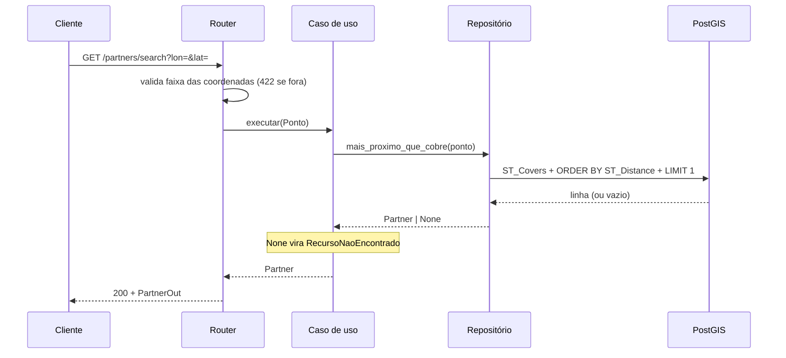

# 03 — Arquitetura de Aplicação (Fase C)

## Camadas

| Camada | Pasta | Pode importar | Responsabilidade |
|--------|-------|---------------|------------------|
| Domínio | `app/domain/` | nada do projeto | Geometria, entidade `Partner`, portas, erros |
| Aplicação | `app/application/` | `domain` | As três operações do desafio |
| Interface | `app/interfaces/` | `application`, `domain`, e `infrastructure` só em `deps.py` | HTTP ↔ caso de uso |
| Infraestrutura | `app/infrastructure/` | `domain` | PostGIS, memória, configuração |

A dependência aponta **sempre para dentro**. O domínio não importa FastAPI nem
SQLAlchemy: a geometria é `math` e dataclasses.

## Portas e adaptadores

| Porta | Adaptador em produção | Adaptador alternativo |
|-------|-----------------------|-----------------------|
| `PartnerRepositorio` | `PartnerRepositorioPostGIS` | `PartnerRepositorioMemoria` (dev e testes) |

O adaptador em memória não é só um dublê de teste: com `REPOSITORIO=memory` a
API sobe inteira sem banco, o que torna a demonstração do projeto trivial para
quem for avaliá-lo.

## A decisão estrutural: onde mora a geometria

A regra *"esta área cobre este ponto"* poderia morar só no PostGIS. Aqui ela
mora em **dois** lugares, de propósito:

```
app/domain/geo.py          ray casting em Python  →  regra de negócio explícita
PostGIS (ST_Covers + GIST) execução em escala     →  desempenho
tests/db/test_paridade…    os dois concordam?     →  prova de equivalência
```

**Vantagem:** a regra é legível e testável em milissegundos, e o banco continua
livre para otimizar. **Custo:** duas implementações da mesma coisa, que podem
divergir. O teste de paridade existe justamente para transformar essa
divergência em falha de CI, e não em bug de produção.

O ray casting do domínio é deliberadamente simples: não trata o anti-meridiano
nem geodésicas sobre o esferoide. Para áreas de entrega urbanas, a diferença
é irrelevante; a nota está no código, não escondida.

## Fluxo de um request



Erro de domínio sobe como exceção e vira status HTTP num lugar só:
`app/interfaces/http/errors.py`. Nenhum caso de uso conhece código HTTP.

## Estratégia de testes

| Camada | Teste | O que prova | Custo |
|--------|-------|-------------|-------|
| Domínio | `tests/unit/test_geo.py` | Ponto-em-polígono, buracos, validação GeoJSON, distância | ms |
| Aplicação | `tests/unit/test_casos_de_uso.py` | Filtro antes da ordenação, unicidade | ms |
| Interface | `tests/integration/` | Contrato HTTP, status codes | s, sem serviço externo |
| Infraestrutura | `tests/db/` | `ST_Covers`, metros, índice, paridade | exige PostGIS |

Detalhes e trade-offs em [ADR-0004](adr/0004-estrategia-de-testes.md).
