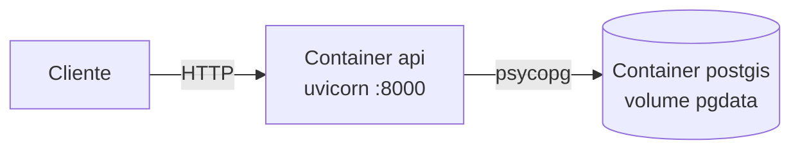
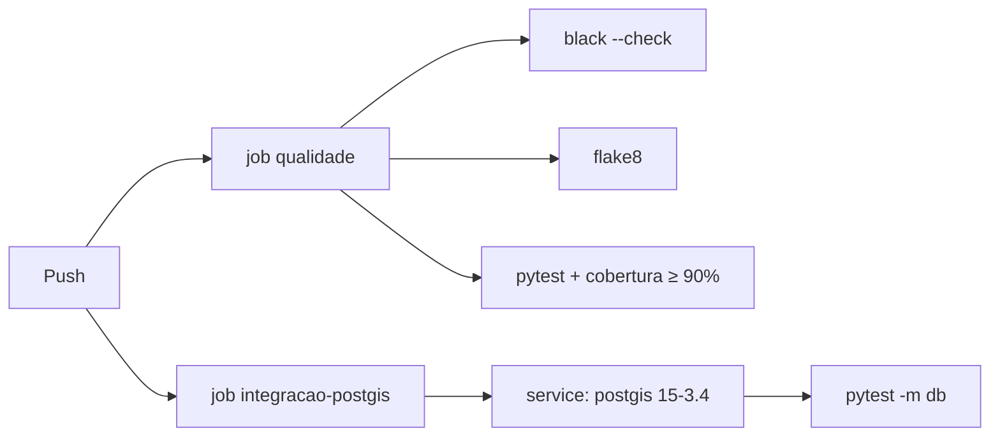

# 04 — Arquitetura de Tecnologia (Fase D)

## Stack

| Função | Tecnologia | Por quê |
|--------|------------|---------|
| Linguagem | Python 3.12 | Tipagem moderna, dataclasses |
| API | FastAPI | Validação declarativa, OpenAPI e injeção de dependência |
| Banco | PostgreSQL 15 + **PostGIS 3.4** | Índice GIST e funções geográficas maduras |
| Acesso a dados | SQLAlchemy 2.0 (SQL explícito) | As funções PostGIS ficam visíveis, não escondidas por ORM |
| Migrations | Alembic | Extensão, tabela e índices versionados |
| Testes | pytest, pytest-cov | Da geometria pura ao HTTP |
| Qualidade | black, flake8 | Formatação e lint sem discussão |
| Empacotamento | Docker, docker compose | Requisito de multiplataforma do desafio |
| CI | GitHub Actions | Dois jobs: qualidade e integração com PostGIS |

A imagem do banco é `postgis/postgis:15-3.4`, não `postgres:15`: a oficial não
traz a extensão, e `CREATE EXTENSION postgis` falharia.

## Implantação

O container da API roda `alembic upgrade head` antes do uvicorn, e o
`depends_on` com `condition: service_healthy` garante que o banco aceita
conexão antes da migration rodar.

## Configuração por ambiente

| Variável | Default | Observação |
|----------|---------|------------|
| `POSTGRES_HOST/PORT/DB/USER/PASSWORD` | localhost / 5432 / partners / app / change-me | No compose, o host é `postgis` |
| `REPOSITORIO` | `postgis` | `memory` sobe a API sem banco |
| `TEST_POSTGRES_URL` | — | Sem ela, `tests/db/` se pula |

## Performance

O critério do desafio é explícito: *"quanto mais parceiros na base de dados e
mais rápido você conseguir buscar, melhor"*. O que sustenta isso hoje:

1. **Índice GIST em `coverage_area`** — o filtro `ST_Covers` usa a bounding box
   do polígono para descartar a maioria dos candidatos antes do teste exato.
2. **Índice GIST em `address`** — serve à ordenação por distância.
3. **`LIMIT 1` no banco** — só uma linha trafega, independentemente do tamanho
   da base.
4. **Um único round-trip** — filtro e ordenação na mesma consulta.

`test_busca_usa_o_indice_gist` lê o `EXPLAIN` e falha se o índice deixar de ser
usado. Não é benchmark: é uma trava contra regressão estrutural, que é o que
um teste consegue garantir de forma determinística. Medição de latência sob
carga está no roadmap (lacuna L5).

## Pipeline

O piso de 90% no job rápido é intencional: o adaptador PostGIS não é
exercitado lá, e sim no job com banco. Inflar o número excluindo o arquivo da
medição seria esconder o dado — o piso menor, explicado, é mais honesto.
